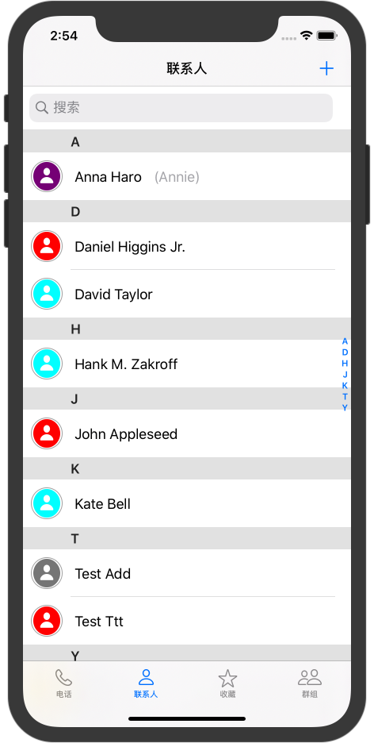
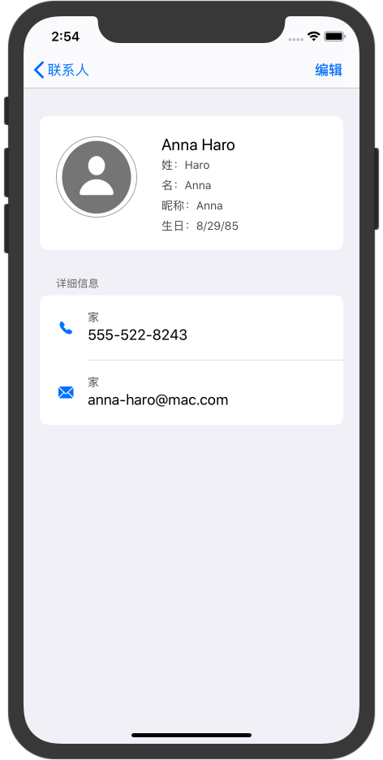
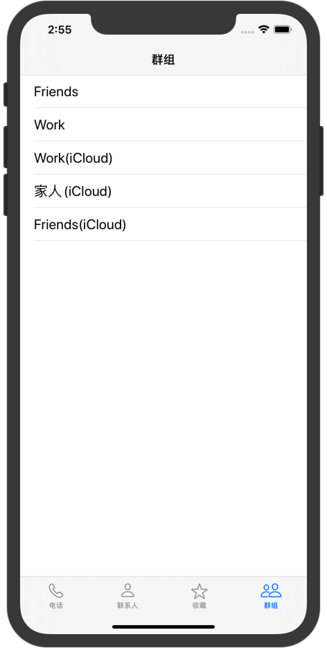
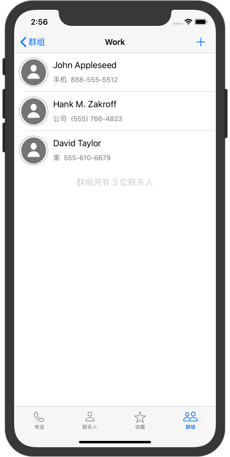

# JHContact
iOS学习 -- 电话本  通讯录

## 特性
* 索引条
* 搜索
* 二级界面
* 群组管理
* 联系人添加和编辑

## 依赖
用了 Apple 在iOS9 之后使用的框架Contacts和ContactsUI

## 系统要求
使用了 iOS13 才提供的系统图标，所以 iOS 需要 13.0 或更高 同时需要 Xcode 11.0或更高

## example

